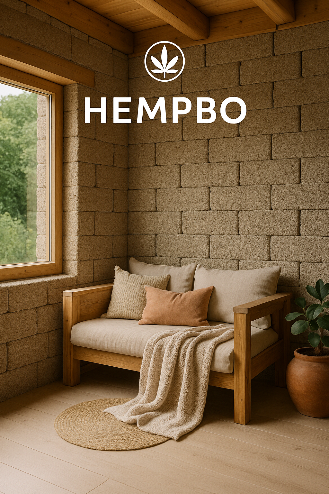

## 🧱 Bygg ett kollektivt projekt kring hampa

**Vision:**\
Skapa ett gemenskapsbaserat, självförsörjande samhälle där hampa är både byggmaterial och försörjningsresurs. Genom att gå ihop som grupp delar vi på kostnader, arbete och lärande.

---

### 🔍 1.1 Identifiera rätt personer att gå ihop med

**Vilka vi söker:**

- Delar värderingar kring hållbarhet, frihet och enkelhet
- Intresserade av att bo kollektivt men självständigt
- Har eller vill lära sig praktiska färdigheter (odling, bygg, snickeri, projektledning etc.)

**Vägar att hitta varandra:**

- Facebookgrupper: "Självförsörjande livsstil", "Ekobyar i Sverige"
- Egna annonser och infoposter på BildaEkoby.se
- Skapa en presentationssida eller PDF-flyer för projektet att dela

---

### 🌍 1.2 Köpa mark tillsammans

**Vad vi söker:**

- 5–20 hektar beroende på antal hushåll
- Tillgång till vatten (bäck, sjö, brunn)
- Befintliga ekonomibyggnader att använda direkt
- Låg grad av detaljplanering = mer frihet
- Gärna jordbruksfastighet

**Sätt att äga tillsammans:**

- Ekonomisk förening, kooperativ eller bolag
- Gemensamt ägande av mark med privata byggrätter via avstyckning eller interna arrenden
- Tydliga avtal och gemensamma värderingar som grund

---

### 🌿 1.3 Odla hampa för bygg och försörjning

**Mål:**

- Odla industrihampa för att producera hampahalm till byggmaterial
- Eventuellt även till fiber, fröolja, te eller textil

**Vad som krävs:**

- Odlartillstånd från Jordbruksverket
- Välja EU-godkänd sort (ex: Futura 75, Felina 32)
- Utrustning för skörd och eventuell förbehandling

**Första stegen:**

- Småskalig testodling för att lära oss
- Bygga prototyper av hampablock
- Nätverka med Hampaföreningen eller andra liknande initiativ

---

### 🛠️ 1.4 Använd befintliga byggnader under uppstartsfas

- Använd befintliga byggnader till:
  - Verkstäder för att producera byggmaterial
  - Lager för hampa och utrustning
  - Tillfälligt boende
  - Kurslokaler och gemensamma ytor för arbete och planering

---

## 🏡 2. Samarbeta med arkitekt och ta fram flexibel husmodell

**Syfte:**
Utforma hus som är lätta att bygga själv, billiga i drift och anpassningsbara efter olika behov och familjekonstellationer.

### 🤝 2.1 Hitta rätt arkitekt

- Specialiserad på ekologiskt och energieffektivt byggande
- Erfarenhet av naturmaterial (hampa, lera, halm, trä)
- Intresse av att medverka i eller stödja ett kooperativt projekt

**Möjliga vägar:**

- Söka i nätverk som Ekobyggportalen, Permakulturföreningen, Arkitekter för hållbar utveckling
- Direktkontakt med arkitekter som jobbat med t.ex. halmbalshus, hampa eller tiny house

### 🏘️ 2.2 Ta fram en husmodell att bygga på plats eller i moduler

- Förslag: en baskonstruktion på 50–70 kvm som kan byggas ut i etapper
- Anpassningsbar planlösning beroende på familjens storlek och behov
- Design för energieffektivitet: passivhustänk, bra isolering, låg drift
- Utformad för att kunna byggas med hampablock, hampa-lera eller hampakalk

### ✅ 2.3 Framtida återanvändning av modellen

- Avtal med arkitekten om rätt att återanvända modellen för vidare försäljning eller workshops
- Erbjuda andra möjligheten att bygga liknande hus till rimlig kostnad
- Skapa en husmodell som kan bli "plattform" för spridning av konceptet

---

### 💸 2.4 Uppskattad kostnad per hushåll

En grov uppskattning av vad ett hus på cirka 60–70 kvm kan kosta inom ramen för detta projekt, förutsatt mycket egen arbetsinsats och delade resurser:

| Kostnadspost                           | Uppskattning (SEK)    | Kommentar                                                    |
| -------------------------------------- | --------------------- | ------------------------------------------------------------ |
| **Andel av markköp**                   | 100 000–300 000       | Beroende på antal hushåll, markläge och befintliga byggnader |
| **Grundläggning**                      | 30 000–60 000         | Plintgrund eller enklare platta, mycket kan göras själva     |
| **Stomme och tak**                     | 50 000–100 000        | Träreglar, takstolar, takbeklädnad                           |
| **Hampablock (egna)**                  | 10 000–20 000         | Om hampan odlas och blocken formas själva                    |
| **Fönster och dörrar**                 | 20 000–40 000         | Billigare vid återbruk                                       |
| **Installationsmaterial (el, vatten)** | 20 000–40 000         | Lägre vid off-gridlösning                                    |
| **Inredning, kök, badrum**             | 20 000–50 000         | Går att minimera med återbruk och enkelhet                   |
| **Verktyg och gemensamma maskiner**    | 5 000–15 000          | Delas inom gruppen                                           |
| **Oförutsett / buffert**               | 20 000                | För säkerhets skull                                          |
| **Totalt per hushåll (grovt)**         | **275 000 – 645 000** | Långt under traditionell byggkostnad                         |

**Kostnadspressande strategier:**

- Odla och processa hampan själv
- Återbruka material där det går
- Bygg tillsammans i grupp
- Använd enkel, repeterbar husmodell
- Välj off-gridlösningar där möjligt

---

## 🔋 3. Självförsörjning av energi, vatten och mat

**Syfte:**
Skapa ett robust, resilient och billigt system för att täcka grundläggande behov – utan beroende av externa leverantörer.

---

### 🔆 3.1 Energi – el och värme

**Möjliga lösningar:**

- Solceller + batterilagring
- Solvärme (för varmvatten)
- Rak vedeldning (kamin, köksspis)
- Biokolraketkök eller biogasanläggning på sikt

**Gemensamma strategier:**

- Bygga central värmeanläggning för gemensamma utrymmen
- Isolera husen väl – minimerar behov av värme
- Lågenergibelysning och elsmart design

---

### 💧 3.2 Vattenförsörjning

**Källor:**

- Egen brunn (borrad eller grävd)
- Regnvattensamling med filter
- Närhet till bäck eller sjö för reservvatten

**Hantering:**

- Gemensam reningslösning (ex: sandfilter, UV-filter)
- Vattensnåla lösningar: torrtoalett, snålspolande dusch, gråvattenåtervinning

---

### 🥕 3.3 Matproduktion

**Metoder:**

- Täckodling, perennodling och växthus
- Gemensamma odlingsytor + privata täppor
- Odla stapelgrödor: potatis, rotsaker, kål, lök, gråärt etc.
- Fruktträd, bärbuskar och örter
- Kompostering och bokashi för kretslopp

**Möjliga tillägg:**

- Svampodling (ex. i byggnader eller skuggigt läge)
- Smådjur: höns, ankor eller getter för gödsel, ägg och ev. mjölk
- Gemensamt beredningskök för torkning, syltning och fermentering

---

## 💰 4. Inkomst och ekonomi

**Syfte:**
Skapa långsiktig ekonomisk trygghet för deltagarna utan att vara beroende av traditionella heltidsjobb. Vi bygger en gemensam infrastruktur för försörjning baserat på platsens resurser, gruppens färdigheter och affärsmöjligheter kopplade till projektet.

---

### 🏭 4.1 Kooperativt företagande – tillsammans som bas

- Starta ett gemensamt företag eller kooperativ för att hantera:
  - Försäljning av produkter (t.ex. hampablock, odlingsprodukter, förädlade varor)
  - Projektleverans av huskonceptet till andra
  - Kurser, visningar, utbildningar, retreat- eller volontärprogram

**Fördelar:**

- Flera kan bidra på deltid inom sina kompetenser
- Inkomst kan spridas ut och skalas upp gradvis
- Alla är delägare och delar på vinster och ansvar

---

### 🧱 4.2 Sälja huskonceptet

- Efter att ha testat och utvecklat modellen kan vi erbjuda:
  - Kompletta byggsatser med hampablock och byggmanual
  - Kurser i självbyggeri och hampablockstillverkning
  - Möjlighet att bygga på plats tillsammans med beställaren (som ett byggteam)
- Sälj till andra ekobyar, småbrukare eller självbyggare som vill leva hållbart

---

### 🌱 4.3 Sälja överskott från odling och förädling

- Grönsaker, frukt, svamp, örter, konserver och fermenterade produkter
- Urtinkturer, hampate, hampolja eller andra naturliga hälsoprodukter
- Deltagande i REKO-ringar, marknader, andelsjordbruk (CSA)

---

### 💡 4.4 Kreativa inkomster och distansarbete

- Egen verksamhet inom design, programmering, musik, skrivande, m.m.
- Distansarbete deltid medan projektet växer
- Skapa digitala produkter kopplade till projektet: blogg, bok, YouTube-serie, onlinekurser

---

## 🤝 5. Gemenskap och social struktur

**Syfte:**
Skapa en levande, trygg och inkluderande gemenskap där både självständighet och samarbete ryms. Ett samhälle där vi delar på resurser, kunskap och ansvar – men respekterar varandras olika behov och livsstilar.

---

### 🫂 5.1 Värderingar och gemensam riktning

- Formulera gemensamma värderingar och riktlinjer för samlevnad
- Klargör hur beslut tas: konsensus, rådslag, majoritet etc.
- Skapa strukturer för att hantera konflikter och främja dialog

---

### 🏘️ 5.2 Privat och gemensamt

- Varje hushåll har sin egen bostad, men:
  - Delar resurser: verktyg, fordon, tvättstuga, beredningskök
  - Gemensamma utrymmen: samlingslokal, växthus, verkstad
  - Möjlighet till gemensamma måltider eller arbetsdagar

---

### 🧑‍🤝‍🧑 5.3 Barn och familjeliv

- Barn får leva nära naturen och vuxna med olika färdigheter
- Gemensam lek, lärande och trygghet – men respekt för föräldrars roller
- Möjlighet att organisera hemundervisning, mikroförskola eller kooperativ skolform

---

### 🎉 5.4 Kultur och gemenskapsskapande

- Högtider, sång, hantverk, berättelser – skapa egna traditioner
- Bygg gemenskap med rytmer och ritualer: fredagsmiddag, gemensam trädgårdsdag, eldhelg etc.
- Bjud in vänner, volontärer eller gäster att delta och inspireras

---

## 💡 6. Möjlig finansiering och bidrag

**Syfte:**
Att kartlägga konkreta ekonomiska möjligheter för att starta, testa och utveckla projektet genom bidrag, stöd och innovationsfinansiering.

---

### 🌾 6.1 Gårdsstöd och grödrelaterade ersättningar (Jordbruksverket)
- **För vad?** Odling av industrihampa kräver registrering och berättigar till gårdsstöd samt andra miljöersättningar.
- **Villkor:** Minst 0,1 ha odling, godkänd EU-sort och ansökan via SAM.
- **Stöd:** 10 000–30 000 kr/år beroende på markyta och tilläggsersättningar.

---

### 🏗️ 6.2 Investerings- & projektstöd (CAP 2023–27)
- **För vad?** Investeringar i byggnader, maskiner, lokaler, innovation, samarbete eller nyetablering på landsbygd.
- **Exempel:** Hampablocktillverkning, visningshus, utbildning, gemensam verkstad.
- **Stödnivå:** 30–80 % beroende på typ av investering.
- **Möjligt belopp:** 300 000 – 2 000 000 kr+ beroende på projektets omfattning.
- **Sök via:** Länsstyrelsen (regional handläggning).

---

### 🏡 6.3 LEADER-bidrag
- **För vad?** Lokal utveckling med fokus på hållbarhet, samverkan och lokal nytta.
- **Passar till:** testodling, pilotprojekt, kooperativ utveckling, evenemang, utbildning.
- **Belopp:** 100 000 – 1 000 000 kr
- **Sök via:** Din lokala LEADER-grupp.

---

### 💡 6.4 Vinnova – innovation och klimatnytta
- **För vad?** Innovationsprojekt med samhällsnytta, kooperativa modeller och klimatlösningar.
- **Exempel:** Hållbart byggsystem med hampablock, affärsmodell för ekobyar.
- **Belopp:** 300 000 – 2 000 000 kr, ofta i stegvisa utlysningar.
- **Stödnivå:** upp till 80 %.

---

### 🏛️ 6.5 Arvsfonden (om social inkludering)
- **För vad?** Projekt för barn, unga eller personer med funktionsnedsättning.
- **Exempel:** pedagogisk gård, mikroförskola, inkluderande gemenskap.
- **Belopp:** upp till full kostnadstäckning.

---

### ⚡ 6.6 Övriga stöd och kompletterande vägar
- **Energimyndigheten:** klimatsmarta energilösningar, off-grid
- **Klimatklivet (Naturvårdsverket):** investeringar som minskar utsläpp (t.ex. biokol, solvärme)
- **Tillväxtverket:** kooperativ och företagande på landsbygd
- **Crowdfunding / medlemsinvestering:** kan ge både startkapital och delaktighet

---

### 💰 Sammanfattande stödnivåer (realistiskt per projekttyp)

| Typ av projekt                         | Möjligt stöd (SEK)          |
|----------------------------------------|------------------------------|
| Gårdsstöd och arealbaserade ersättningar | 10 000 – 30 000 / år         |
| Investeringsstöd (CAP)                | 300 000 – 2 000 000+         |
| LEADER                                | 100 000 – 1 000 000          |
| Vinnova                               | 300 000 – 2 000 000          |
| Arvsfonden                            | upp till 100 % finansiering  |

**Tips:**
- Kombinera stödformer (ex. LEADER + CAP + crowdfunding)
- Tänk i etapper: testodling → pilotbygge → skalning
- Samverka med kommun, universitet eller ideella föreningar för ökad genomslagskraft

---

Bilderna kommer att visas direkt i README-filen när den visas på GitHub, GitLab eller andra plattformar som stöder Markdown.

**Tips:** 
- Använd beskrivande alt-text för tillgänglighet
- Håll bildfilerna under 1MB för snabb laddning
- Använd vanliga format som PNG, JPG, eller SVG

